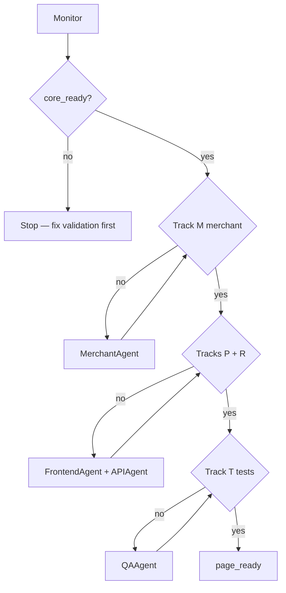

# Payment UI Agent System (Monitor + Sub-agents)

**Prerequisite:** Validation **`core_ready`** ✅ (Tracks A+B+C). Reward rules trusted before payment UX.

**Goal:** One **Monitor** agent supervises payment-moment page work; **fixer sub-agents** implement; Monitor re-runs gates + pytest before accepting merges.

**Requirements source of truth:** [`payment-ui-requirements.md`](payment-ui-requirements.md)

---

## Tracks (Monitor order)

| Track | Phase | Gate | Monitor check |
|-------|-------|------|---------------|
| **V** Prerequisite | 0 | `core_ready` | validation dashboard |
| **M** Merchant | 1 | Fuzzy URL + catalog + resolve API | `payment-ui-monitor` track M |
| **P** Page UX | 2 | Homepage `/` + confirm modal + resolve-before-recommend | static + flow |
| **R** Recommend API | 2 | `merchant_id`, full library default | API contract |
| **T** Tests | 3 | pytest merchant + pay web green | `pytest tests/test_merchant_mapping.py tests/test_pay_web.py` |

**Rule:** `page_ready` = V + M + P + R + T. Monitor does **not** mark milestone shipped until then.

---

## Agent roster

| Agent | Track | Scope | Acceptance |
|-------|-------|-------|------------|
| **Monitor** | All | Direction vs requirements, gate re-run, tracker | `payment-ui-monitor` → `page_ready` |
| **MerchantAgent** | M | `merchant_mapping.py`, `merchant_categories.yaml` | Fuzzy long URL resolves; catalog grows |
| **FrontendAgent** | P | `static/index.html`, confirm modal, copy | URL tab always confirms; rankings UI |
| **APIAgent** | R | `web/app.py` resolve + recommend | `merchant_id` path; full library |
| **QAAgent** | T | pytest + manual smoke | All pay tests pass |

---

## Monitor workflow



### Every Monitor session

```bash
cd creditRewards && source .venv/bin/activate

credit-rewards-db validation-monitor-run   # V — must stay core_ready
credit-rewards-db payment-ui-monitor       # M/P/R/T plan + gates
pytest -q tests/test_merchant_mapping.py tests/test_pay_web.py tests/test_payment_ui_e2e_smoke.py

bash scripts/dev_web.sh    # :8000 — use this instead of bare uvicorn
bash scripts/smoke_payment_ui.sh
```

Autonomous re-check loop:

```bash
credit-rewards-db payment-ui-monitor-run
```

---

## Fixer prompts (Cursor Task)

### MerchantAgent
> Expand `data/merchants/merchant_categories.yaml`. Improve fuzzy scoring in `merchant_mapping.py` for payment-processor URLs. Run `pytest tests/test_merchant_mapping.py -q`. Do **not** add LLM merchant guessing.

### FrontendAgent
> Work only on `static/index.html`. Flow: resolve → confirm modal → recommend. URL tab **always** shows confirm. Match dark theme. No new routes unless Monitor approves.

### APIAgent
> Work on `web/app.py` recommend/resolve contracts. `merchant_id` after user confirm. Default `card_keys` = full registry. Keep backward-compatible `category`/`mcc` paths.

### QAAgent
> Add/update tests in `tests/test_merchant_mapping.py`, `tests/test_pay_web.py`. Run full pay pytest. Report failures with file + assertion.

### Monitor (verification)
> Compare diff to `payment-ui-requirements.md`. Re-run `payment-ui-monitor-run`. Update [`payment-ui-tracker.md`](payment-ui-tracker.md). Reject scope creep (wallet auth, extension, Plaid).

---

## Tracker

Live status: [`payment-ui-tracker.md`](payment-ui-tracker.md)

---

## Post-MVP backlog (Monitor deprioritizes)

- User wallet filter (2–3 cards) — founder chose full library for v1
- Manual category picker fallback
- `/pay` separate route — homepage is canonical
- Valuation mode toggle in UI
