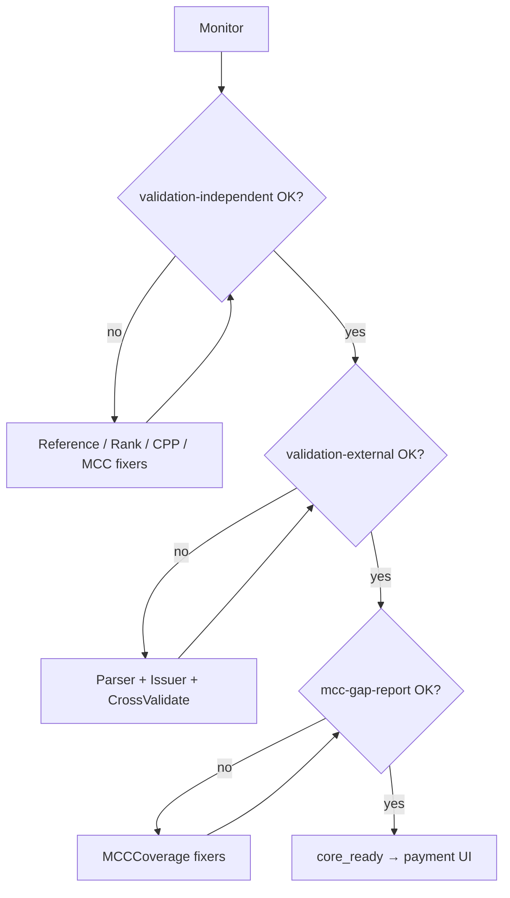

# Validation Agent System (Monitor + Fixers)

**Goal:** One **Monitor** agent supervises two **core tracks** before payment UI:

1. **External cross-validation** — raw issuer scrape vs Rewards CC reference (no overlay)
2. **MCC category gap** — Phase-1 earn categories classified with MCC or merchant-only strategy

Fixer sub-agents implement; Monitor re-runs gates and pytest before accepting work.

---

## Tracks (Monitor order)

| Track | Phase | Gate | Monitor command |
|-------|-------|------|-----------------|
| Internal | A | L1, L3, CPP, top-24 MCC | `validation-independent` |
| **External** | **B (CORE)** | ≥90% earn rows cross-verified (≥2 signals) | `validation-external` |
| **MCC gap** | **C (CORE)** | 100% classified; ≥70% bonus cats have MCC path | `mcc-gap-report` |
| L2 overlay | D (legacy) | Scrape+reference overlay compare | `validation-monitor --include-l2` |

**Rule:** `core_ready` requires tracks A + B + C. Monitor released payment UI work when core complete.

**Next:** [`payment-ui-agent-system.md`](payment-ui-agent-system.md) — Monitor supervises homepage `/` against [`payment-ui-requirements.md`](payment-ui-requirements.md).

---

## Agent roster

| Agent | Track | Scope | Acceptance |
|-------|-------|-------|------------|
| **Monitor** | All | Orchestration, pytest, re-verify | `validation-monitor` → `core_ready` |
| **Reference** | Internal | L1 import | 20/20 validate-reference |
| **Benchmark / Rank** | Internal | L3 golden | ≥95% golden pass |
| **CPP** | Internal | official_cpp.yaml | All programs sourced |
| **MCC** | Internal | top-24 MCC codes | TOP_VALIDATION_MCCS mapped |
| **ExternalValidator** | External | Full raw scrape run | `validation-external` exits 0 |
| **CrossValidate** | External | Per-card issuer evidence | Each row ≥2 independent signals |
| **Parser** | External | Raw scrape failures | `scrape_card_page_raw(align=False)` succeeds |
| **Issuer** | External | Low cross-verify cards | Issuer page supports reference or scrape |
| **MCCCoverage** | MCC gap | Category matrix gaps | Dedicated MCC or merchant-only doc |

---

## Cross-validation signals (External track)

A row is **cross-verified** only with ≥2 independent signals:

| Signal | Source |
|--------|--------|
| `reference` | Rewards CC JSON |
| `raw_scrape` | Issuer page parser (no reference overlay) |
| `issuer_page` | Evidence snippets from issuer HTML |

Examples:
- Aligned raw scrape + reference → cross-verified ✓
- Mismatch + `reference_supported` on issuer page → cross-verified ✓
- Mismatch + ambiguous evidence → **not** cross-verified; Issuer agent reviews `/compare`

---

## Monitor workflow



### Every Monitor session

```bash
cd creditRewards && source .venv/bin/activate
pip install -e ".[dev]"

paycue-db validation-independent
paycue-db validation-external
paycue-db mcc-gap-report
paycue-db validation-monitor

pytest -q tests/test_validation_external.py tests/test_mcc_gap.py
uvicorn credit_rewards.web.app:app --port 8000
```

---

## Fixer prompts (Cursor Task)

### ExternalValidator
> Run `paycue-db validation-external`. No reference overlay. Write report to `reports/validation/external-crosscheck-*.json`.

### CrossValidate + Issuer
> For each low cross-verify card: open `/compare`, read issuer evidence, classify reference_ok vs stale vs parser_bug.

### MCCCoverage
> Run `mcc-gap-report`. Add MCC codes in `data/mcc/visa_mcc_categories.yaml` for gap categories, or document merchant-only strategy.

### Monitor (verification)
> After fixers merge: re-run all three gates + pytest. Update `validation-agent-tracker.md`. Do not mark ship ready until `core_ready`.

---

## Tracker

Live status: [`validation-agent-tracker.md`](validation-agent-tracker.md)
