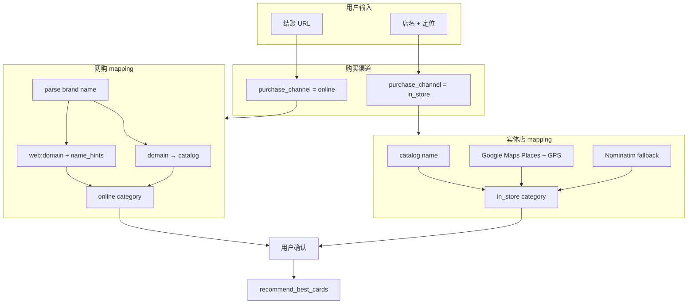

# Purchase Channel & Merchant Mapping Plan

**Status:** Draft for founder review  
**Date:** 2026-06-07  
**Related:** `idea.md` (payment moment), `plan.md` Phase 1b, partial impl in `merchant_mapping.py`

---

## 1. Problem

用户在付款前需要知道「用哪张卡 reward 最高」。但 **同一家品牌** 在两种场景下，issuer 给的 bonus category 往往不同：

| 场景 | 用户行为 | 例子 | 典型 reward category |
|------|----------|------|----------------------|
| **实体店** | 在店里刷卡 / Apple Pay | Nike 门店、Central Market 店内 | All Purchases、Grocery Stores、Dining… |
| **官网网购** | 在 brand.com / checkout URL 付款 | nike.com 结账、Amazon | **Online Shopping**、Streaming… |

若把 `nike.com` 当成「附近 Nike 实体店」去 Google Maps 匹配，会得到 **错误的 category**（实体店 ≠ 网购）。

**目标：** 在 recommend 之前，先确定 **purchase channel（购买渠道）**，再按渠道做 **merchant → spend_bonus_category** mapping。

---

## 2. 核心原则

1. **Channel 先于 POI** — 先问「网上买还是店里买」，再决定用哪套 resolver。
2. **实体店用 Google Maps** — 定位 + Places 找真实 POI → Google type / name hint → category。
3. **网购不用 Google Maps 实体店** — URL / 域名 → 目录或规则推断 → **online category**。
4. **用户确认** — 低置信度（推断、默认 Online Shopping）必须 confirm modal。
5. **Recommend 只吃 category** — 引擎层仍用 Rewards CC 的 `spendBonusCategoryName`；channel 只影响 mapping 结果。

---

## 3. 如何区分两种场景（产品层）

### 3.1 MVP：显式 UI（已实现，founder 已确认）

**规则（2026-06-07）：URL = 网站网购；店名 = 实体店。**

| UI 入口 | 默认 `purchase_channel` | 用户意图 |
|---------|-------------------------|----------|
| **URL** | `online` | 粘贴 checkout / 官网链接 → **网站 reward** |
| **店名** | `in_store` | 输入店名 → **实体店 reward**（可 + 定位 → Google Maps） |

**规则：**

- Tab A **不请求定位**，**不调用** Google Maps Places。
- Tab B **请求定位**（可选但强烈建议），调用 Google Maps 匹配附近门店。

### 3.2 Post-MVP（可选增强）

- 结账 URL 上检测 payment gateway（Stripe/PayPal）→ 仍从 embedded URL 抽 merchant domain，channel 仍为 `online`。
- 同页 toggle：「我在官网买 / 我在店里买」— 仅当用户粘贴 brand 官网且选错 tab 时补救。
- 浏览器扩展 / 分享 sheet 自动带 `purchase_channel=online`。

### 3.3 API 契约

```json
POST /api/merchant/resolve
{
  "merchant_url": "https://www.nike.com/checkout",
  "purchase_channel": "online"
}

POST /api/merchant/resolve
{
  "merchant_name": "Nike",
  "latitude": 30.27,
  "longitude": -97.74,
  "purchase_channel": "in_store"
}
```

`purchase_channel` 省略时：**有 URL → online，有 name → in_store**。

---

## 4. Merchant 身份模型（两种 ID 空间）

Recommend 需要稳定的 `merchant_id` + 已确认的 `spendBonusCategoryName`。

| 来源 | `merchant_id` 前缀 | 含义 | 用于 channel |
|------|-------------------|------|--------------|
| 本地目录 | `chipotle`, `nike` | 人工维护 brand + domain | both |
| 网购推断 | `web:nike.com` | 从 URL 解析、目录未命中 | **online only** |
| Google Maps | `gmaps:ChIJ…` | 具体 POI + 地址 | **in_store only** |
| OpenStreetMap | `osm:…` | 免费 fallback POI | **in_store only** |

**禁止交叉：** `gmaps:*` 不得用于 `purchase_channel=online`；`web:*` 不得用于 `in_store` recommend（除非用户改 channel）。

---

## 5. Category mapping 策略

### 5.1 目录结构（`merchant_categories.yaml`）

每个 merchant 行支持 **双 category**：

```yaml
- id: nike
  name: Nike
  domains: [nike.com]
  spend_bonus_category_name: Online Shopping   # 默认 / 网购
  in_store_category: All Purchases             # 实体店（可选）
  # 未来: online_category: Online Shopping     # 显式字段（与 spend_bonus 合并逻辑见下）
```

**解析规则（`_spend_category_for_row`）：**

| channel | 使用字段 |
|---------|----------|
| `online` | `online_category` ?? `spend_bonus_category_name` |
| `in_store` | `in_store_category` ?? `spend_bonus_category_name` |

**纯网购品牌**（Amazon、Netflix）：只填 `spend_bonus_category_name`，不设 `in_store_category`。

**双渠道品牌**（Nike、Walmart、Target、Apple）：必须填两个 category（或文档说明为何相同）。

### 5.2 实体店 mapping 管道（`in_store`）

```text
店名 (+ 可选 checkout URL with channel=in_store)
  → [1] 目录 exact / fuzzy name
  → [2] Google Places Text Search + locationBias
        → primaryType / types → google_place_category_map.yaml
        → 可选 websiteUri 与 brand domain 交叉验证
  → [3] Nominatim fallback（无 key / 失败时）
  → 用户 confirm → merchant_id (gmaps:* 或 catalog id)
  → spend_bonus_category_name（来自 POI type 或 catalog in_store_category）
```

**Google Maps 角色：** 把「店名」映射到 **真实 POI + MCC-like type**，不是映射到官网。

### 5.3 网购 mapping 管道（`online`）

```text
结账 URL / 官网 URL
  → [1] 从 URL 抽 domain（含 Stripe/PayPal 内嵌 URL）
  → [2] 目录 domain exact / fuzzy
  → [3] parse_store_brand_from_url → display_name（Central Market, Nike）
  → [4] 目录 name / alias partial match
  → [5] 仍未命中 → web:{domain} + _infer_online_category(display_name)
        → google_place_category_map.yaml 的 name_hints（仅作 category，不作 POI）
        → 默认 Online Shopping
  → 用户 confirm → merchant_id (catalog id 或 web:*)
  → spend_bonus_category_name（online 字段）
```

**网购不用 Google Maps 的原因：** Places 返回的是 **地理实体**，不是 **支付 MCC 上下文**。Issuer 的「Online Shopping」bonus 看的是 **交易发生在 merchant 网站**，不是用户离哪家店近。

### 5.4 网站 category 的三层来源（优先级）

| 优先级 | 来源 | 置信度 | 例子 |
|--------|------|--------|------|
| P0 | 目录 `online` / `spend_bonus_category_name` | 高 | nike.com → Online Shopping |
| P1 | `name_hints` 规则（品牌名关键词） | 中 | centralmarket → Grocery Stores |
| P2 | 默认 `Online Shopping` | 低（需 confirm） | 未知 Shopify 小店 |

**Post-MVP P1.5：** Rewards CC 文档提到的 **Google Maps Spend API**（若订阅允许）— 仅作 category hint，仍不绑 POI。

---

## 6. 与 Recommend 的衔接

```text
resolve (channel + url|name)
  → MerchantResolveResult { best, candidates, purchaseChannel, needsConfirmation }
  → 用户 confirm
  → POST /api/recommend {
       merchant_id,
       category: best.spendBonusCategoryName,  // gmaps/web 时必须带
       amount_usd,
       card_keys
     }
  → recommend_best_cards(wallet, PurchaseContext(category, amount))
```

**外部 ID 确认规则：**

- `gmaps:*` / `osm:*` / `web:*` → recommend 必须传 **用户确认过的** `category`（已实现）。
- 目录 `nike` → 可直接 `merchant_id=nike`，category 由服务端 lookup。

---

## 7. 典型品牌对照表（验收用）

| 品牌 | 网购 URL | 网购 category | 实体店输入 | 实体店 category | 备注 |
|------|----------|---------------|------------|-------------------|------|
| Nike | nike.com | Online Shopping | Nike + 定位 | All Purchases | 双 category |
| Amazon | amazon.com | Online Shopping | （少见） | All Purchases? | 网购为主 |
| Chipotle | order.chipotle.com | Dining | Chipotle + 定位 | Dining | 线上线下同 category |
| Central Market | centralmarket.com | Grocery Stores | Central Market + 定位 | Grocery Stores | 网购无目录时用 name_hint |
| Apple | apple.com | Online Shopping | Apple Store + 定位 | All Purchases? | 需产品定 Apple Store 线下类 |
| Walmart | walmart.com | Grocery / Online? | Walmart + 定位 | Grocery Stores | 需 founder 定 walmart.com 网购类 |

---

## 8. 分阶段实施

### Phase A — 固化 channel（当前 sprint，部分已做）

- [x] `purchase_channel` API + UI 双 tab
- [x] online 路径跳过 Google Maps
- [x] `web:*` merchant_id + online 推断
- [x] Nike 等目录双 category 字段（Nike 已加）
- [ ] 更新 `payment-ui-requirements.md` 写清 R2c Google = in_store only
- [ ] 目录 audit：Top 20 常用 merchant 补全 `in_store_category` / 网购 domain

### Phase B — 数据质量

- [ ] `merchant_categories.yaml` 增加 `channel_notes`（可选，给人看）
- [ ] 监控：resolve 结果按 channel 分桶统计（online 命中率 / gmaps 误触率）
- [ ] 测试矩阵：§7 表格自动化 pytest

### Phase C — 网购增强（不用 Google 实体店）

- [ ] 结账 URL 路径特征（`/checkout`, `cart`, `pay`) 提高 online 置信度
- [ ] 常见 marketplace 域名表（ebay.com, etsy.com）→ Online Shopping
- [ ] 可选：轻量 **website category**（不绑 POI）— 仅当 P0/P1 都失败

### Post-MVP

- [ ] Rewards CC Google Maps Spend API（category hint）
- [ ] MCC 来自支付页（若 extension 能读）
- [ ] 用户纠正 channel / category → 反馈进目录

---

## 9. 明确 Out of Scope

- 用 Google Maps **实体店 POI** 推断 **网购** Online Shopping（原则禁止）
- LLM 猜 merchant / category
- 自动识别用户「其实在店里却粘贴了 URL」（除非用户改 tab）
- 同一请求同时 optimize 网购 + 实体店两张最优卡

---

## 10. 成功标准（本 plan 验收）

| # | 标准 |
|---|------|
| S1 | `nike.com` + online → Online Shopping，**不出现** gmaps POI |
| S2 | `Nike` + in_store + 定位 → gmaps POI，category ≠ Online Shopping（按目录 in_store） |
| S3 | `centralmarket.com` + online → Grocery Stores（非 Google 实体店地址） |
| S4 | `Central Market` + in_store + 定位 → gmaps 附近门店 + Grocery |
| S5 | confirm modal 展示 channel（网购 / 线下店）+ category + 置信度 |
| S6 | recommend 使用的 category 与 confirm 一致 |

---

## 11. 当前代码与 plan 差距（implement 前对齐）

| 项 | 状态 |
|----|------|
| 双 tab + purchase_channel | ✅ |
| online 跳过 Google Maps | ✅ |
| in_store Google Maps | ✅ |
| web:* online fallback | ✅ |
| 目录双 category 字段 | ⚠️ 仅 Nike，需扩展 |
| payment-ui-requirements 同步 | ❌ |
| Walmart / Apple 等边界定义 | ❌ 需 founder 确认 |
| Tab 文案「第一个实体店第二个网站」 | ⚠️ 当前 UI 是「网购 URL / 线下店名」，与 founder 表述一致但顺序可对调 |

---

## 12. Founder 决策点（review 时请确认）

1. ~~**Tab 顺序与命名**~~ → **已确认：「网站 | 实体店」**
2. ~~**Walmart.com / Target.com 网购**~~ → **Online Shopping**；实体店见上表
3. ~~**Apple.com 网购 vs Apple Store 线下**~~ → Online Shopping / All Purchases
4. ~~**未知网站**~~ → **网购，默认 Online Shopping + confirm**
5. **Phase B 目录 audit** 是否优先于 Phase C 网购增强？

### ✅ 已确认（2026-06-07）

**购买渠道推断（无例外默认）：**

| 用户输入 | `purchase_channel` | 含义 |
|----------|-------------------|------|
| **URL**（结账页 / 官网链接） | `online` | **网站网购** — 目录 + URL 解析，不用 Google Maps 实体店 |
| **店名** | `in_store` | **实体店** — Google Maps + 定位（或目录 in_store category） |

**UI 标签：** 「**网站** | **实体店**」（URL tab = 网站，店名 tab = 实体店）

**未知网站：** 一律按网购处理；category 默认 **Online Shopping**（低置信度，需用户 confirm）。

**Walmart / Target 等：**

| 品牌 | 网站（URL） | 实体店（店名） |
|------|------------|----------------|
| Walmart | Online Shopping | Grocery Stores |
| Target | Online Shopping | All Purchases |
| Nike | Online Shopping | All Purchases |
| Apple | Online Shopping | All Purchases |

不在 MVP 做「同屏切换 channel」；用户通过 **选 URL 还是店名** 表达意图。

---

## 附录：数据流图


