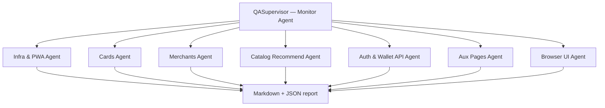

# Production QA Tester — Multi-Agent Plan

**Target (required):** https://paycue-production.up.railway.app  
**Not allowed:** `localhost` / `127.0.0.1` — QA validates the **deployed** build only.  
**Runner:** `python scripts/qa_production.py`  
**Reports:** `reports/qa/production-latest.md`

---

## Architecture



| Agent | ID | Scope |
|-------|-----|--------|
| **Supervisor** | — | Orchestrates agents, merges results, writes report |
| Infra & PWA | `infra` | Health, homepage, manifest, SW, static bundles, payment-ui monitor |
| Cards | `cards` | Registry 20 cards + PNG files, all issuers search, batch images, coverage |
| Merchants | `merchants` | Config, nearby GPS, **all 36 catalog merchants** online + in-store resolve, suggestions, fuzzy URL |
| Catalog Recommend | `catalog_rec` | **`/api/recommend` for every catalog card** (527 keys) at Starbucks in-store |
| Auth & Wallet API | `auth` | Register, login, logout, wallet GET/PUT (API exists; UI not shipped) |
| Aux Pages | `aux` | `/compare`, `/validation`, validation APIs |
| Browser UI | `browser` | Languages, onboarding, tabs, wallet issuer search, online + in-store recommend, savings, reset, home |

API agents run **in parallel** (each with its own HTTP client). Browser agent runs **after** API agents (Playwright).

---

## Full catalog sweep (all cards)

1. `GET /api/cards/catalog-keys` → 527 keys (same as wallet catalog index)
2. Fallback if endpoint missing: enumerate `/api/cards/issuers` × `by-issuer` (warn if count &lt; coverage)
3. For **each** `card_key`: `POST /api/recommend` with `{ merchant_id: starbucks, card_keys: [key], amount_usd: 25 }`
4. Report: `CAT-01` pass/fail ratio + list of failed keys in JSON

This catches **every** catalog card that fails import (not only Chase Starbucks).

---

## Browser UI operations matrix

| ID | Operation |
|----|-----------|
| UI-LANG-* | First-run language: en / es / zh |
| UI-02 | Onboarding: pick card → Get started |
| UI-03 | Pay tabs: Website ↔ In store |
| UI-04 | Location permission hint on in-store tab |
| UI-05 | Nearby store chips (mock GPS) |
| UI-06 | Wallet → issuer search Chase |
| UI-07 | Online URL recommend (Chipotle) |
| UI-08 | In-store recommend (Starbucks) |
| UI-09 | Savings history navigation |
| UI-10 | Reset modal cancel |
| UI-11 | Home brand shortcut |
| UI-12 | Change language from wallet |

---

## How to run

```bash
cd creditRewards
source .venv/bin/activate
pip install -e ".[qa]"
playwright install chromium

# Full multi-agent QA (production URL default)
python scripts/qa_production.py

# API-only (faster CI)
python scripts/qa_production.py --no-browser

# Tune catalog sweep concurrency
python scripts/qa_production.py --workers 15
```

Exit code: `0` = pass, `1` = any **fail**, `2` = tried localhost.

---

## Status semantics

| Status | Meaning |
|--------|---------|
| **pass** | Works per spec |
| **warn** | Degraded (e.g. issuer images without API key; incomplete key enumeration) |
| **fail** | Broken user/API path |
| **skip** | Agent skipped (`--no-browser`) |

---

## Post-MVP

- GitHub Action on Railway deploy → `python scripts/qa_production.py --no-browser`
- Nightly full run with browser track
- Per-merchant recommend matrix (each merchant × each registry card)
