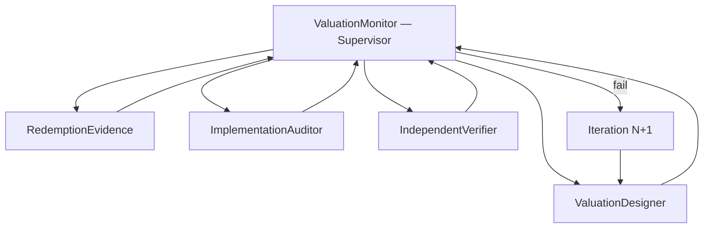

# Points → Dollar Valuation — Multi-Agent System

**Status:** Phase 1 (design + evidence + independent verify)  
**Core product risk:** Wrong `$` at checkout destroys trust  
**Supervisor command:** `python scripts/valuation_verify.py`  
**Design spec:** [../architecture/points-to-dollar-valuation-report.md](../architecture/points-to-dollar-valuation-report.md)

---

## Goal

Produce and **independently verify** a defensible mapping from:

```text
(purchase amount, merchant category, card earn rules) → points_earned → estimated_value_usd
```

Each program CPP must have **redemption proof** (what you can buy / transfer for how many cents per point).

---

## Agent roster



| Agent | ID | Role | Output |
|-------|-----|------|--------|
| **ValuationMonitor** | `monitor` | Orchestrates rounds; gates pass/fail | `reports/validation/valuation-verify-latest.json` |
| **ValuationDesigner** | `designer` | Methodology, CPP table, UX rules | Updates `official_cpp.yaml`, design doc |
| **RedemptionEvidence** | `evidence` | Per-program proof: portal / transfer / cash floor | Evidence rows with URLs + math |
| **ImplementationAuditor** | `impl` | Code path: `compute_earn_value`, `_enrich_wallet`, UI labels | Golden scenarios + bug list |
| **IndependentVerifier** | `independent` | **No designer doc** — only external sources | Challenge report; must ≥2 signals per CPP |

**Rule:** `IndependentVerifier` runs **after** Evidence + Impl pass. It must **not** read designer rationale first (only YAML numbers + external URLs).

---

## Iteration workflow (each round)

### Round N — Design

1. **ValuationDesigner** updates methodology / CPP candidates / card overrides.
2. Run `paycue-db refresh-official-cpp`.

### Round N — Build evidence

3. **RedemptionEvidence** fills proof table (see main report §4):
   - Cash floor (statement credit / pay with points)
   - Portal baseline
   - Best defensible transfer (optional upper bound; we use **max** for product)

### Round N — Implementation audit

4. **ImplementationAuditor** runs:
   ```bash
   pytest tests/test_valuation.py tests/test_valuation_twenty_cards.py tests/test_official_cpp.py -q
   python scripts/valuation_verify.py --agents impl evidence
   ```
5. Checks:
   - Every registry card has `official_cpp > 0` after `_enrich_wallet`
   - Catalog cards resolve program (not stuck on `Cash` at 1.0¢ unless truly cash)
   - `points_earned` label vs cash-back semantics
   - Golden: Amex Gold $100 grocery → **$8.80**

### Round N — Independent verification

6. **IndependentVerifier** cross-checks each program CPP against **≥2 independent signals**:
   | Signal | Example source |
   |--------|----------------|
   | `rewards_cc` | `baseSpendEarnValuation` on registry cards |
   | `upgraded_points` | `program_benchmarks.yaml` |
   | `awardwallet` | AW sync (when enabled) |
   | `issuer_portal` | Amex travel portal $/pt, Chase portal, etc. |
   | `floor` | `baseSpendEarnCashValue` (minimum redemption) |

7. Verifier flags:
   - CPP > sanity cap (3.5¢) without evidence
   - CPP > best transfer blog claim without issuer backup
   - Implementation `$` differs from hand calculation > 1¢

### Round N — Monitor gate

8. **ValuationMonitor** publishes:
   - `reports/validation/valuation-evidence-YYYY-MM-DD.md`
   - `valuation-verify-latest.json` with `valuation_ready: true|false`

**Ship gate for UI copy change:** `valuation_ready` + IndependentVerifier signed off.

---

## Acceptance criteria (`valuation_ready`)

| Gate | Threshold |
|------|-----------|
| Program CPP sourced | 100% programs in `official_cpp.yaml` |
| Evidence rows | Each program has floor + portal + external benchmark |
| Golden scenarios | 100% pass (20 registry cards + 5 edge cases) |
| Independent cross-check | ≥2 signals agree within 0.3¢ OR documented override |
| Production smoke | `/api/recommend` returns `cpp_used` matching table |
| UX | UI shows `$` from `estimated_value_usd` only; footnote for estimate |

---

## Cursor Task prompts (copy-paste)

### ValuationDesigner
> Read `docs/architecture/points-to-dollar-valuation-report.md`. Propose CPP changes only with redemption proof. Update `data/curated/official_cpp.yaml` if approved.

### RedemptionEvidence
> For each program in `official_cpp.yaml`, add evidence: cash floor ¢/pt, travel portal ¢/pt, transfer partner example. Cite issuer or UP/TPG URLs. Output markdown table.

### ImplementationAuditor
> Trace `recommend` → `_enrich_wallet` → `compute_earn_value`. List bugs where `$` could equal raw multiplier or points count. Run golden tests.

### IndependentVerifier
> **Do not read the design doc narrative.** Given only `official_cpp.yaml` and external sites, verify each CPP is defensible. Flag overstatement.

### ValuationMonitor
> Run `python scripts/valuation_verify.py`. If any agent fails, dispatch fixer and re-run until `valuation_ready`.

---

## Post-MVP

- User-facing CPP footnote + “how we estimate” sheet
- Conservative mode (floor CPP) as optional setting
- Wallet-aware overrides (CFU valued as UR only if user holds CSP)
